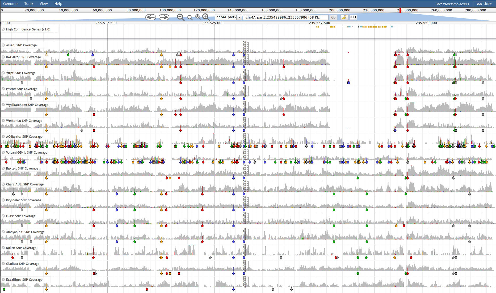

For the purpose of demonstrating a Snakemake workflow in reasonable time, we will be working on a subset of public WGS data from wheat. Specifically, we will be looking at data from a small (58Kbp) region on the long arm of chromosome 4A (chr4A_part2:235500000-235558000). This region contains 2 genes affected by a deletion which is present in some wheat accessions:

DAWN URL: [chr4A_part2:235500000-235558000](crobiad.agwine.adelaide.edu.au/dawn/jbrowse/?loc=chr4A_part2%3A235500000..235558000&tracks=IWGSC_v1.0_HC_genes%2CAlsen_snpcoverage%2CRAC875_snpcoverage%2CYitpi_snpcoverage%2CPastor_snpcoverage%2CWyalkatchem_snpcoverage%2CWestonia_snpcoverage%2CACBarrie_snpcoverage%2CVolcanii_snpcoverage%2CBaxter_snpcoverage%2CChara_snpcoverage%2CDrysdale_snpcoverage%2CH45_snpcoverage%2CXiaoyan_snpcoverage%2CKukri_snpcoverage%2CGladius_snpcoverage%2CExcalibur_snpcoverage)



# Software Environment Setup

I will assume you have a functioning installation of Anaconda. We will now install the tools required into a new conda environment:

```bash
conda create \
  --name snakemake_webinar \
  --channel conda-forge --channel bioconda \
   samtools=1.9 \
   htslib=1.9
```

The next set is to activate the environment so we have access to the tools we just installed within it:

```bash
source activate snakemake_webinar
```

# Extracting Data Subsets

We will extract all the data relevant to this region of the genome, including:

  - Reference sequence corresponding to `chr4A_part2:235500000-235558000` (equivilent coordinates in full pseudomolecule is `chr4A:688055092-688113092`
  - Reads aligned to this region for several WGS data sets
     - Convert the extracted reads to FASTQ format

## Extract Genomic Reference Sequence

```bash
COORD="chr4A:688055092-688113092"
CHR="${COORD%%:*}"

# Download the chromosome FASTA file - zip files can't be unzip on a stream so we have to download the whole file
wget "https://urgi.versailles.inra.fr/download/iwgsc/IWGSC_RefSeq_Assemblies/v1.0/iwgsc_refseqv1.0_${CHR}.fsa.zip"

# Lets convert it to block gzipped (bgzip) format so it can be indexed by SAMtools
unzip -p "iwgsc_refseqv1.0_${CHR}.fsa.zip" \
  | bgzip --threads 4 \
  > "iwgsc_refseqv1.0_${CHR}.fasta.gz"

# Extract the region of interest
mkdir -p references
samtools faidx "iwgsc_refseqv1.0_${CHR}.fasta.gz" "${COORD}" \
  | bgzip --threads 1 \
  > "references/${COORD}.fasta.gz"
```

## Extract WGS Reads Mapped to the Region

```bash
COORD="chr4A_part2:235500000-235558000"

ACCESSIONS=(
  Alsen
  RAC875
  Yitpi
  Pastor
  Wyalkatchem
  Westonia
  ACBarrie
  Volcanii
  Baxter
  Chara
  Drysdale
  H45
  Xiaoyan
  Kukri
  Gladius
  Excalibur
)

# Ensure the output dir is present
mkdir -p reads

# For each accession:
#  1) Extract the reads aligning to the specified region
#  2) Collate the reads into the correct order
#  3) Output paired reads in FASTQ format
for ACCESSION in "${ACCESSIONS[@]}"; do
  echo "Processing: ${ACCESSION}"
  samtools view -hu "http://crobiad.agwine.adelaide.edu.au/dawn/jbrowse-prod/data/local/by_chr/mapped_reads_merged/161010_Chinese_Spring_v1.0_pseudomolecules_parts.fasta.gz/minimap2_defaults/whole_genome/PE/BPA/chr4A_part2/${ACCESSION}.realigned.bam" "${COORD}" \
  | samtools collate -uO - \
  | samtools fastq -F 0x900 -1 "reads/${ACCESSION}_R1.fastq.gz" -2 "reads/${ACCESSION}_R2.fastq.gz" -s /dev/null -0 /dev/null -
done
```

# Cleanup the Enviroment

Once we have finished, we will delete files we nolonger need and deactive the conda environment:

```bash
rm -f "iwgsc_refseqv1.0_${CHR}.fsa.zip" *.bai
source deactivate
```
